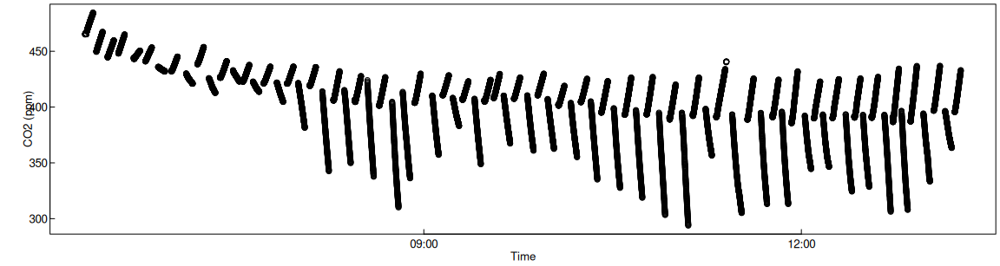
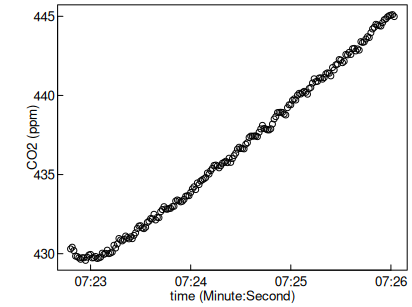
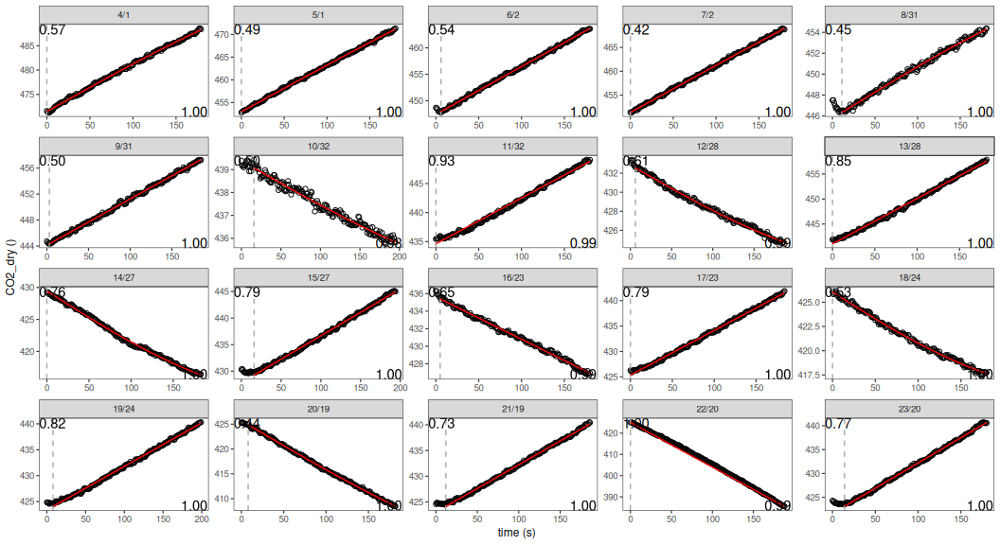

# Processing several measurement cycles

    if (!exists("isDevelopMode")) library(RespChamberProc)
    set.seed(0815)      # for reproducible results

## Superseded

RespChamberProc 0.6.6 associated each chunk with the notion of a collar.
This allows to specify different chamber setups, importantly volume,
with different chunks.

Hence, this vignette still works using function
`calcClosedChamberFluxForChunks`, it is superseded by vignette
`switchingChambers` that uses function
`calcClosedChamberFluxForChunkSpecs.`

## Determine subsets of single measurement cycles

First, the data is loaded. Here, directly from zipped logger-output.

    fName <- system.file(
      "genData/SMANIE_Chamber1_26032015.zip", package = "RespChamberProc")
    if (nzchar(fName) ) { 
      ds <- readDat(
        unz(fName, filename = unzip(fName, list = TRUE)[1,"Name"] ),tz = "UTC") }
    head(ds)
    plot( CO2_LI840 ~ TIMESTAMP, ds, ylab = "CO2 (ppm)", xlab = "Time")

    ## # A tibble: 6 × 17
    ##   TIMESTAMP           RECORD Chamber Collar AirTemp AirPres   PAR BodyTemp
    ##   <dttm>               <int>   <int>  <int>   <dbl>   <dbl> <dbl>    <dbl>
    ## 1 2015-03-26 06:18:28 261827       1      0    5.14    988.  5.30     6.46
    ## 2 2015-03-26 06:18:29 261828       1      0    5.14    988.  5.30     6.46
    ## 3 2015-03-26 06:18:30 261829       1      0    5.14    988.  5.30     6.46
    ## 4 2015-03-26 06:18:31 261830       1      0    5.13    988.  5.30     6.45
    ## 5 2015-03-26 06:18:32 261831       1      0    5.13    988.  5.30     6.45
    ## 6 2015-03-26 06:18:33 261832       1      0    5.13    988.  5.30     6.45
    ## # ℹ 9 more variables: SurTemp <dbl>, SoilTemp <dbl>, SoilMoist <dbl>,
    ## #   CO2_LI840 <dbl>, H2O_LI840 <dbl>, T_LI840 <dbl>, P_LI840 <dbl>,
    ## #   PTemp <dbl>, Batt <dbl>

The dataset contains several measurement cycles of light and dark
chambers with increasing or decreasing concentrations respectively.

First, we correct the pressure to standard units and correct the CO2
concentrations for water vapour.

    ds$Pa <- ds$AirPres * 100  # convert hPa to Pa
    ds$CO2_dry <- corrConcDilution(ds, colConc = "CO2_LI840", colVapour = "H2O_LI840")
    ds$H2O_dry <- corrConcDilution(ds, colConc = "H2O_LI840", colVapour = "H2O_LI840")
    ds$VPD <- calcVPD( ds$SurTemp, ds$Pa, ds$H2O_LI840)

In order to process each measurement cycle independently, we first
determine parts of the time series that are contiguous, i.e. without
gaps and without change of an index variable, here variable `collar`.

    dsChunk <- subsetContiguous(ds, colTime = "TIMESTAMP", colIndex = "Collar") 
    head(dsChunk)

    ## # A tibble: 6 × 23
    ##   iChunk TIMESTAMP           RECORD Chamber Collar AirTemp AirPres   PAR
    ##   <fct>  <dttm>               <int>   <int>  <int>   <dbl>   <dbl> <dbl>
    ## 1 4      2015-03-26 06:19:20 261864       1      1    4.99    988.  3.31
    ## 2 4      2015-03-26 06:19:21 261865       1      1    4.99    988.  3.97
    ## 3 4      2015-03-26 06:19:22 261866       1      1    4.98    988.  5.30
    ## 4 4      2015-03-26 06:19:23 261867       1      1    4.98    988.  5.30
    ## 5 4      2015-03-26 06:19:24 261868       1      1    4.98    988.  5.30
    ## 6 4      2015-03-26 06:19:25 261869       1      1    4.98    988.  5.30
    ## # ℹ 15 more variables: BodyTemp <dbl>, SurTemp <dbl>, SoilTemp <dbl>,
    ## #   SoilMoist <dbl>, CO2_LI840 <dbl>, H2O_LI840 <dbl>, T_LI840 <dbl>,
    ## #   P_LI840 <dbl>, PTemp <dbl>, Batt <dbl>, Pa <dbl>, CO2_dry <dbl>,
    ## #   H2O_dry <dbl>, VPD <dbl>, collar <int>

The modified dataset contains a new variable, `iChunk`, which reports a
factor that changes with different measurement cycles. This factor can
be used to select subset of single measurement cycles.

    dss <- subset(dsChunk, iChunk == 15)
    plot( CO2_dry ~ TIMESTAMP, dss, ylab = "CO2 (ppm)", xlab = "time (Minute:Second)")

## Computing the flux

Function `calcClosedChamberFluxForChunks` helps with subsetting the data
and applying function `calcClosedChamberFlux` to each subset.

    # for demonstration use only the first 20 cycles
    dsChunk20 <- subset(dsChunk, as.integer(iChunk) <= 20) 
    chamberVol = 0.6*0.6*0.6        # chamber was a cube of 0.6m length
    surfaceArea = 0.6*0.6

    resChunks1 <- calcClosedChamberFluxForChunks(
      dsChunk20, colTemp = "AirTemp"
      # linear and saturating shape
      , fRegress = c(lin = regressFluxLinear, tanh = regressFluxTanh)   
      , debugInfo = list(omitEstimateLeverage = TRUE)   # faster
      , volume = chamberVol
      , area = surfaceArea
    )

    ## Warning in calcClosedChamberFluxForChunks(dsChunk20, colTemp = "AirTemp", :
    ## calcClosedChamberFluxForChunks is superseded by
    ## calcClosedChamberFluxForChunkSpecs. Consider it instead.

    head(resChunks1)

    ## # A tibble: 6 × 18
    ## # Groups:   iChunk [6]
    ##   iChunk  flux fluxMedian sdFlux  tLag tmax  lagIndex autoCorr   AIC
    ##   <fct>  <dbl>      <dbl>  <dbl> <dbl> <lgl>    <int>    <dbl> <dbl>
    ## 1 4       2.55         NA 0.0355     0 NA           1    0.570 -136.
    ## 2 5       2.65         NA 0.0272     0 NA           1    0.486 -156.
    ## 3 6       2.33         NA 0.0297     6 NA           7    0.538 -168.
    ## 4 7       2.54         NA 0.0238     0 NA           1    0.419 -160.
    ## 5 8       1.29         NA 0.0264    11 NA          12    0.447 -177.
    ## 6 9       1.82         NA 0.0106     3 NA           4    0.498 -148.
    ## # ℹ 9 more variables: sdFluxRegression <dbl>, sdFluxLeverage <dbl>,
    ## #   iFRegress <dbl>, sdResid <dbl>, iqrResid <dbl>, r2 <dbl>, times <list>,
    ## #   model <list>, collar <int>

The results are similar as for `calcClosedChamberFlux`, unless there are
several rows identified by additional key column iChunk.

## Plotting faceted data and fits

Plot the results to dectect problems.

    library(ggplot2)
    plots <- plotCampaignConcSeries( dsChunk20, resChunks1, plotsPerPage = 64L)  
    print(plots$plot[[1]]) # print the first page

If argument `fileName` is provided to `plotCampaignConcSeries`. All
plots are written to a pdf. If there are more cycles, i.e. plots, than
argument `plotsPerPage`(default 64) there will be several pages in the
pdf.

## Inspecting lag-times

Lag times between closing the chamber and the start of the concentration
increase, i.e. when the gas arrives at the sensor, is by default
estimated by a breakpoint detection method. This method is not robust to
fluctuations, early saturation, or other possible pecularities of the
concentration time series. In other to detect those subsets, where
lag-time detection has failed, on can inspect the inferred lag-times for
outliers.

For a campaign where all the measurement cycles were performed with
similar conditions, the lag-time should not differ much.

    table(resChunks1$tLag)

    ## 
    ##  0  3  5  6  8 11 12 14 16 
    ##  9  1  1  2  2  1  1  1  2

We infer that for this campaign a lag-time of about 15 seconds is
appropriate.

One can save processing time and avoid breakpoint-detection failures by
specifying a fixed lag-time during the concentration fitting by
parameter `useFixedTLag`.

    resChunks2 <- calcClosedChamberFluxForChunks(
      dsChunk20, colTemp = "T_LI840"
      # linear and saturating shape
      , fRegress = c(lin = regressFluxLinear, tanh = regressFluxTanh)   
      , debugInfo = list(omitEstimateLeverage = TRUE)   # faster
      , volume = chamberVol
      , area = surfaceArea
      , useFixedTLag = 15
    )

    ## Warning in calcClosedChamberFluxForChunks(dsChunk20, colTemp = "T_LI840", :
    ## calcClosedChamberFluxForChunks is superseded by
    ## calcClosedChamberFluxForChunkSpecs. Consider it instead.

    head(resChunks2)

    ## # A tibble: 6 × 18
    ## # Groups:   iChunk [6]
    ##   iChunk  flux fluxMedian sdFlux  tLag tmax  lagIndex autoCorr   AIC
    ##   <fct>  <dbl>      <dbl>  <dbl> <dbl> <lgl>    <int>    <dbl> <dbl>
    ## 1 4       2.12         NA 0.0289    15 NA          16    0.496 -127.
    ## 2 5       2.23         NA 0.0257    15 NA          16    0.467 -136.
    ## 3 6       1.98         NA 0.0114    15 NA          16    0.550 -139.
    ## 4 7       2.15         NA 0.0101    15 NA          16    0.470 -127.
    ## 5 8       1.11         NA 0.0237    15 NA          16    0.446 -170.
    ## 6 9       1.56         NA 0.0103    15 NA          16    0.498 -128.
    ## # ℹ 9 more variables: sdFluxRegression <dbl>, sdFluxLeverage <dbl>,
    ## #   iFRegress <dbl>, sdResid <dbl>, iqrResid <dbl>, r2 <dbl>, times <list>,
    ## #   model <list>, collar <int>
