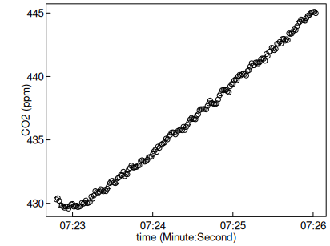
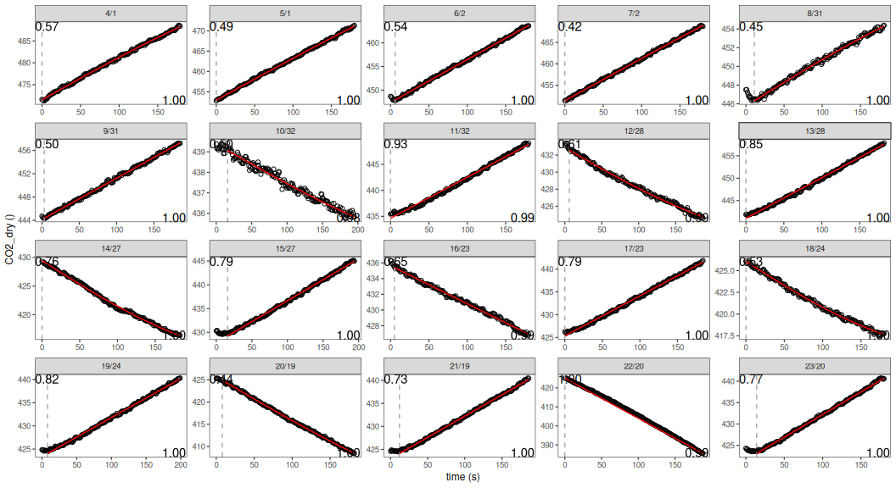

# Processing several measurement cycles of different setup

    if (!exists("isDevelopMode")) library(RespChamberProc)
    set.seed(0815)      # for reproducible results

## Determine subsets of single measurement cycles

First, the data is loaded. Here, directly from zipped logger-output.

    library(dplyr)
    # fit chambers in parallel inside calcClosedChamberFluxForChunkSpecs
    library(furrr)
    plan(multisession, workers = 4) 

    fName <- system.file(
      "genData/SMANIE_Chamber1_26032015.zip", package = "RespChamberProc")
    if (nzchar(fName) ) { 
      ds <- readDat(
        unz(fName, filename = unzip(fName, list = TRUE)[1,"Name"] ),tz = "UTC") }
    head(ds)
    plot( CO2_LI840 ~ TIMESTAMP, ds, ylab = "CO2 (ppm)", xlab = "Time")

    ## # A tibble: 6 × 17
    ##   TIMESTAMP           RECORD Chamber Collar AirTemp AirPres   PAR BodyTemp
    ##   <dttm>               <int>   <int>  <int>   <dbl>   <dbl> <dbl>    <dbl>
    ## 1 2015-03-26 06:18:28 261827       1      0    5.14    988.  5.30     6.46
    ## 2 2015-03-26 06:18:29 261828       1      0    5.14    988.  5.30     6.46
    ## 3 2015-03-26 06:18:30 261829       1      0    5.14    988.  5.30     6.46
    ## 4 2015-03-26 06:18:31 261830       1      0    5.13    988.  5.30     6.45
    ## 5 2015-03-26 06:18:32 261831       1      0    5.13    988.  5.30     6.45
    ## 6 2015-03-26 06:18:33 261832       1      0    5.13    988.  5.30     6.45
    ## # ℹ 9 more variables: SurTemp <dbl>, SoilTemp <dbl>, SoilMoist <dbl>,
    ## #   CO2_LI840 <dbl>, H2O_LI840 <dbl>, T_LI840 <dbl>, P_LI840 <dbl>,
    ## #   PTemp <dbl>, Batt <dbl>

The dataset contains several measurement cycles of light and dark
chambers with increasing or decreasing concentrations respectively.

First, we correct the pressure to standard units and correct the CO2
concentrations for water vapour.

    ds$Pa <- ds$AirPres * 100  # convert hPa to Pa
    ds$CO2_dry <- corrConcDilution(ds, colConc = "CO2_LI840", colVapour = "H2O_LI840")
    ds$H2O_dry <- corrConcDilution(ds, colConc = "H2O_LI840", colVapour = "H2O_LI840")
    ds$VPD <- calcVPD( ds$SurTemp, ds$Pa, ds$H2O_LI840)

In order to process each measurement cycle independently, we first
determine parts of the time series that are contiguous, i.e. without
gaps and without change of an index variable, here variable `collar`.

    dsChunk <- subsetContiguous(ds, colTime = "TIMESTAMP", colIndex = "Collar") 
    head(dsChunk)

    ## # A tibble: 6 × 23
    ##   iChunk TIMESTAMP           RECORD Chamber Collar AirTemp AirPres   PAR
    ##   <fct>  <dttm>               <int>   <int>  <int>   <dbl>   <dbl> <dbl>
    ## 1 4      2015-03-26 06:19:20 261864       1      1    4.99    988.  3.31
    ## 2 4      2015-03-26 06:19:21 261865       1      1    4.99    988.  3.97
    ## 3 4      2015-03-26 06:19:22 261866       1      1    4.98    988.  5.30
    ## 4 4      2015-03-26 06:19:23 261867       1      1    4.98    988.  5.30
    ## 5 4      2015-03-26 06:19:24 261868       1      1    4.98    988.  5.30
    ## 6 4      2015-03-26 06:19:25 261869       1      1    4.98    988.  5.30
    ## # ℹ 15 more variables: BodyTemp <dbl>, SurTemp <dbl>, SoilTemp <dbl>,
    ## #   SoilMoist <dbl>, CO2_LI840 <dbl>, H2O_LI840 <dbl>, T_LI840 <dbl>,
    ## #   P_LI840 <dbl>, PTemp <dbl>, Batt <dbl>, Pa <dbl>, CO2_dry <dbl>,
    ## #   H2O_dry <dbl>, VPD <dbl>, collar <int>

The modified dataset contains a new variable, `iChunk`, which reports a
factor that changes with different measurement cycles. This factor can
be used to select subset of single measurement cycles.

    dss <- subset(dsChunk, iChunk == 15)
    plot( CO2_dry ~ TIMESTAMP, dss, ylab = "CO2 (ppm)", xlab = "time (Minute:Second)")

## Associating Chamber information to chunks

Different collars may have different depth leading to different volume,
or are connected by tubing of different length to the sensor.

The user needs to provide - a mapping of iChunk to collar in column
`collar` - dimensional information about the collar in a data.frame

Function `subsetContiguous` creates a default for the collar mapping by
assigning the values of the index column.

    dsChunk %>% group_by(iChunk) %>% summarise(collar = first(collar)) %>%  head()

    ## # A tibble: 6 × 2
    ##   iChunk collar
    ##   <fct>   <int>
    ## 1 4           1
    ## 2 5           1
    ## 3 6           2
    ## 4 7           2
    ## 5 8          31
    ## 6 9          31

DataFrame `collar_spec` then needs to specify for each collar id in
column `collar`, the colums `area` (m2) and `volume` (m3), as well a
`tlag` (s), the lag time between start of the cycle , i.e. the start of
the chunk (usually chamber closing time), and the time when the gas
reaches the sensor.

In this example, we specify the same surface area and the same tlag for
each collar but simulate removing the litter and then measuring the
depth of each collar to recompute the volume. The depth, here, are
random numbers around 3 cm. If the lagtime is set to missing (NA) then
it is estimated in each chunk by a breakpoint detection.

    chamberVol = 0.6*0.6*0.6        # chamber was a cube of 0.6m length
    surfaceArea = 0.6*0.6
    collar_spec <- tibble(
      collar = unique(dsChunk$collar), 
      depth = pmax(0,rnorm(length(collar), mean = 0.03, sd = 0.015)),
      area = surfaceArea,
      volume = chamberVol + surfaceArea * depth,
      tlag = NA)
    head(collar_spec)

    ## # A tibble: 6 × 5
    ##   collar   depth  area volume tlag 
    ##    <int>   <dbl> <dbl>  <dbl> <lgl>
    ## 1      1 0.00862  0.36  0.219 NA   
    ## 2      2 0.0117   0.36  0.220 NA   
    ## 3     31 0.0282   0.36  0.226 NA   
    ## 4     32 0.0517   0.36  0.235 NA   
    ## 5     28 0.0155   0.36  0.222 NA   
    ## 6     27 0.0129   0.36  0.221 NA

Problems with association setups to the data can be checked by function
`checkCollarSpec`, which returns FALSE and attribute `msg` in case of
problems.

    checkCollarSpec(dsChunk, collar_spec)

## Computing the flux

Function `calcClosedChamberFluxForChunkSpecs` applies function
`calcClosedChamberFlux` to each subset.

    # for demonstration use only the first 20 cycles
    dsChunk20 <- subset(dsChunk, as.integer(iChunk) <= 20) 
    resChunks1 <- calcClosedChamberFluxForChunkSpecs(
      dsChunk20, collar_spec
      , colTemp = "AirTemp"
      # linear and saturating shape
      , fRegress = c(lin = regressFluxLinear, tanh = regressFluxTanh)   
      , debugInfo = list(omitEstimateLeverage = TRUE)   # faster
    )
    head(resChunks1)

    ## # A tibble: 6 × 18
    ##   iChunk collar  flux fluxMedian sdFlux  tLag  tmax lagIndex autoCorr   AIC
    ##   <fct>   <int> <dbl>      <dbl>  <dbl> <dbl> <dbl>    <int>    <dbl> <dbl>
    ## 1 4           1  2.58         NA 0.0360     0    NA        1    0.570 -136.
    ## 2 5           1  2.69         NA 0.0276     0    NA        1    0.486 -156.
    ## 3 6           2  2.38         NA 0.0303     6    NA        7    0.538 -168.
    ## 4 7           2  2.59         NA 0.0242     0    NA        1    0.419 -160.
    ## 5 8          31  1.35         NA 0.0277    11    NA       12    0.447 -177.
    ## 6 9          31  1.91         NA 0.0111     3    NA        4    0.498 -148.
    ## # ℹ 8 more variables: sdFluxRegression <dbl>, sdFluxLeverage <dbl>,
    ## #   iFRegress <dbl>, sdResid <dbl>, iqrResid <dbl>, r2 <dbl>, times <list>,
    ## #   model <list>

The results are similar as for `calcClosedChamberFlux`, unless there are
several rows identified by additional key columns `iChunk` and
`chamber.`

## Plotting faceted data and fits

We recommend to plot the results together with the concentration data to
dectect problems.

    library(ggplot2)
    plots <- plotCampaignConcSeries( dsChunk20, resChunks1, plotsPerPage = 64L)  
    print(plots$plot[[1]]) # print the first page

If argument `fileName` is provided to `plotCampaignConcSeries`. All
plots are written to a pdf. If there are more cycles, i.e. plots, than
argument `plotsPerPage` (default 64) there will be several pages in the
pdf.

## Inspecting lag-times

Lag times between closing the chamber and the start of the concentration
increase, i.e. when the gas arrives at the sensor, is by default
estimated by a breakpoint detection method. This method is not robust to
fluctuations, early saturation, or other possible peculiarities of the
concentration time series. In other to detect those subsets, where
lag-time detection has failed, on can inspect the inferred lag-times for
outliers.

For a campaign where all the measurement cycles were performed with
similar conditions, the lag-time should not differ much.

    table(resChunks1$tLag)

    ## 
    ##  0  3  5  6  8 11 12 14 16 
    ##  9  1  1  2  2  1  1  1  2

The plots do not indicate problems, and the longest estimated lagtime
varies between 0 and 16 seconds. Since slightly overestimating the
lagtime does not change the flux but only might slightly increase the
uncertainty, we infer that for this campaign a lag-time of about 16
seconds is appropriate.

One can save processing time and avoid failures in the non-robust
breakpoint-detection by specifying a fixed lag-time (may differ across
collars) with the collar specification.

    collar_spec2 <- mutate(collar_spec, tlag = 16)

    resChunks2 <- calcClosedChamberFluxForChunkSpecs(
      dsChunk20, collar_spec2
      , colTemp = "AirTemp"
      # linear and saturating shape
      , fRegress = c(lin = regressFluxLinear, tanh = regressFluxTanh)   
      , debugInfo = list(omitEstimateLeverage = TRUE)   # faster
    )
    head(resChunks2)

    ## # A tibble: 6 × 18
    ##   iChunk collar  flux fluxMedian sdFlux  tLag  tmax lagIndex autoCorr   AIC
    ##   <fct>   <int> <dbl>      <dbl>  <dbl> <dbl> <dbl>    <int>    <dbl> <dbl>
    ## 1 4           1  2.51         NA 0.0348    16    NA       17    0.499 -126.
    ## 2 5           1  2.62         NA 0.0130    16    NA       17    0.497 -118.
    ## 3 6           2  2.36         NA 0.0140    16    NA       17    0.557 -137.
    ## 4 7           2  2.58         NA 0.0293    16    NA       17    0.449 -144.
    ## 5 8          31  1.36         NA 0.0291    16    NA       17    0.444 -169.
    ## 6 9          31  1.91         NA 0.0127    16    NA       17    0.497 -127.
    ## # ℹ 8 more variables: sdFluxRegression <dbl>, sdFluxLeverage <dbl>,
    ## #   iFRegress <dbl>, sdResid <dbl>, iqrResid <dbl>, r2 <dbl>, times <list>,
    ## #   model <list>
