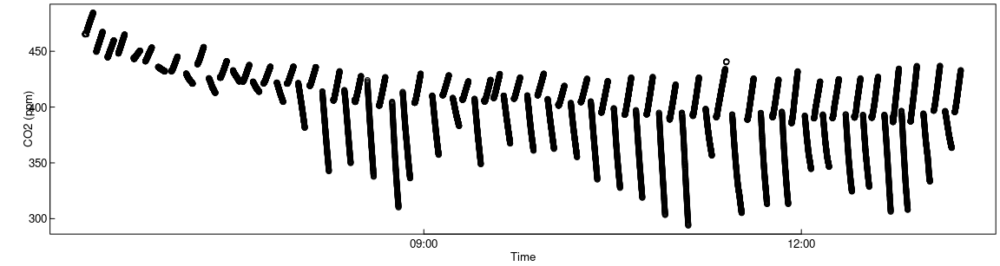
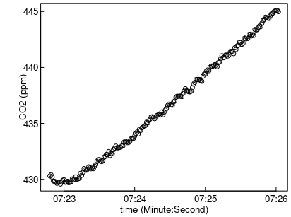

Processing several measurement cycles
=====================================


```r
if (!exists("isDevelopMode")) library(RespChamberProc)
set.seed(0815)      # for reproducible results
```

Determine subsets of single measurement cycles
----------------------------------------------

First, the data is loaded. Here, directly from zipped logger-output.

```r
library(dplyr)
# fit chambers in parallel inside calcClosedChamberFluxForChunkSpecs
library(furrr)
plan(multisession, workers = 4) 

fName <- system.file(
  "genData/SMANIE_Chamber1_26032015.zip", package = "RespChamberProc")
if (nzchar(fName) ) { 
  ds <- readDat(
    unz(fName, filename = unzip(fName, list = TRUE)[1,"Name"] ),tz = "UTC") }
head(ds)
plot( CO2_LI840 ~ TIMESTAMP, ds, ylab = "CO2 (ppm)", xlab = "Time")
```

<!-- -->

```
## # A tibble: 6 × 17
##   TIMESTAMP           RECORD Chamber Collar AirTemp AirPres   PAR BodyTemp SurTemp SoilTemp SoilMoist CO2_LI840 H2O_LI840 T_LI840 P_LI840 PTemp  Batt
##   <dttm>               <int>   <int>  <int>   <dbl>   <dbl> <dbl>    <dbl>   <dbl>    <dbl>     <dbl>     <dbl>     <dbl>   <dbl>   <dbl> <dbl> <dbl>
## 1 2015-03-26 06:18:28 261827       1      0    5.14    988.  5.30     6.46    5.10     6.15      18.1      465.      7.30    51.5    98.8  7.53  12.7
## 2 2015-03-26 06:18:29 261828       1      0    5.14    988.  5.30     6.46    5.11     6.18      18.1      465.      7.29    51.5    98.8  7.53  12.7
## 3 2015-03-26 06:18:30 261829       1      0    5.14    988.  5.30     6.46    5.12     6.21      18.1      465.      7.30    51.5    98.8  7.53  12.7
## 4 2015-03-26 06:18:31 261830       1      0    5.13    988.  5.30     6.45    5.10     6.25      18.1      465.      7.29    51.5    98.8  7.53  12.7
## 5 2015-03-26 06:18:32 261831       1      0    5.13    988.  5.30     6.45    5.10     6.29      18.1      466.      7.28    51.6    98.8  7.53  12.6
## 6 2015-03-26 06:18:33 261832       1      0    5.13    988.  5.30     6.45    5.10     6.32      18.1      465.      7.28    51.5    98.8  7.53  12.6
```

The dataset contains several measurement cycles of light and dark chambers 
with increasing or decreasing concentrations respectively.

First, we correct the pressure to standard units and correct the CO2
concentrations for water vapour.

```r
ds$Pa <- ds$AirPres * 100  # convert hPa to Pa
ds$CO2_dry <- corrConcDilution(ds, colConc = "CO2_LI840", colVapour = "H2O_LI840")
ds$H2O_dry <- corrConcDilution(ds, colConc = "H2O_LI840", colVapour = "H2O_LI840")
ds$VPD <- calcVPD( ds$SurTemp, ds$Pa, ds$H2O_LI840)
```

In order to process each measurement cycle independently, we first determine 
parts of the time series that are contiguous, i.e. without gaps and without 
change of an index variable, here variable `collar`.


```r
dsChunk <- subsetContiguous(ds, colTime = "TIMESTAMP", colIndex = "Collar") 
head(dsChunk)
```

```
## # A tibble: 6 × 23
##   iChunk TIMESTAMP           RECORD Chamber Collar AirTemp AirPres   PAR BodyTemp SurTemp SoilTemp SoilMoist CO2_LI840 H2O_LI840 T_LI840 P_LI840 PTemp  Batt     Pa
##   <fct>  <dttm>               <int>   <int>  <int>   <dbl>   <dbl> <dbl>    <dbl>   <dbl>    <dbl>     <dbl>     <dbl>     <dbl>   <dbl>   <dbl> <dbl> <dbl>  <dbl>
## 1 4      2015-03-26 06:19:20 261864       1      1    4.99    988.  3.31     6.40    5.29     7.57      17.9      468.      7.24    51.6    98.8  7.53  12.6 98774.
## 2 4      2015-03-26 06:19:21 261865       1      1    4.99    988.  3.97     6.39    5.29     7.59      17.9      468.      7.25    51.6    98.8  7.53  12.6 98780.
## 3 4      2015-03-26 06:19:22 261866       1      1    4.98    988.  5.30     6.39    5.3      7.61      18.0      468.      7.25    51.6    98.8  7.53  12.6 98774.
## 4 4      2015-03-26 06:19:23 261867       1      1    4.98    988.  5.30     6.39    5.3      7.62      18.0      468.      7.26    51.6    98.8  7.53  12.6 98780.
## 5 4      2015-03-26 06:19:24 261868       1      1    4.98    988.  5.30     6.39    5.3      7.64      18.0      468.      7.26    51.6    98.8  7.53  12.6 98780.
## 6 4      2015-03-26 06:19:25 261869       1      1    4.98    988.  5.30     6.39    5.30     7.66      17.9      468.      7.26    51.6    98.8  7.53  12.6 98780.
## # ℹ 4 more variables: CO2_dry <dbl>, H2O_dry <dbl>, VPD <dbl>, collar <int>
```

The modified dataset contains a new variable, `iChunk`, which reports a factor that
changes with different measurement cycles.
This factor can be used to select subset of single measurement cycles. 

```r
dss <- subset(dsChunk, iChunk == 15)
plot( CO2_dry ~ TIMESTAMP, dss, ylab = "CO2 (ppm)", xlab = "time (Minute:Second)")
```

<!-- -->
Associating Chamber information to chunks
-----------------------------------------
Different collars may have different depth leading to different volume, or are
connected by tubing of different length to the sensor.

The user needs to provide 
- a mapping of iChunk to collar in column `collar`
- dimensional information about the collar in a data.frame

Function `subsetContiguous` creates a default for the collar mapping
by assigning the values of the index column.


```r
dsChunk %>% group_by(iChunk) %>% summarise(collar = first(collar)) %>%  head()
```

```
## # A tibble: 6 × 2
##   iChunk collar
##   <fct>   <int>
## 1 4           1
## 2 5           1
## 3 6           2
## 4 7           2
## 5 8          31
## 6 9          31
```

DataFrame `collar_spec` then needs to specify for collar id in column `collar`, 
the colums `area` (m2) and `volume` (m3) need to be specified,
as well a column `tlag` (s) that specifies the lag between start of the cycle
, i.e. chamber closing time and the time when the gas reaches the sensor.

We use the same surface area and the same tlag for each collar but simulate 
removing the litter and then measure the depth of each collar 
to recompute the volume by assigning random numbers to the depth.


```r
chamberVol = 0.6*0.6*0.6		# chamber was a cube of 0.6m length
surfaceArea = 0.6*0.6
collar_spec <- tibble(
  collar = unique(dsChunk$collar), 
  depth = pmax(0,rnorm(length(collar), mean = 0.03, sd = 0.015)),
  area = surfaceArea,
  volume = chamberVol + surfaceArea * depth,
  tlag = NA)
head(collar_spec)
```

```
## # A tibble: 6 × 5
##   collar   depth  area volume tlag 
##    <int>   <dbl> <dbl>  <dbl> <lgl>
## 1      1 0.00862  0.36  0.219 NA   
## 2      2 0.0117   0.36  0.220 NA   
## 3     31 0.0282   0.36  0.226 NA   
## 4     32 0.0517   0.36  0.235 NA   
## 5     28 0.0155   0.36  0.222 NA   
## 6     27 0.0129   0.36  0.221 NA
```


```r
checkCollarSpec(dsChunk, collar_spec)
```

```
## [1] TRUE
## attr(,"msg")
## [1] "ok"
```


Computing the flux
------------------

Function `calcClosedChamberFluxForChunkSpecs` helps with subsetting the data 
and applying function `calcClosedChamberFlux` to each subset.


```r
# for demonstration use only the first 20 cycles
dsChunk20 <- subset(dsChunk, as.integer(iChunk) <= 20) 
resChunks1 <- calcClosedChamberFluxForChunkSpecs(
  dsChunk20, collar_spec
  , colTemp = "AirTemp"
  # linear and saturating shape
  , fRegress = c(lin = regressFluxLinear, tanh = regressFluxTanh)	
  , debugInfo = list(omitEstimateLeverage = TRUE)	# faster
)
head(resChunks1)
```

```
## # A tibble: 6 × 17
##   iChunk collar  flux fluxMedian sdFlux  tLag lagIndex autoCorr   AIC sdFluxRegression sdFluxLeverage iFRegress sdResid iqrResid    r2 times       model 
##   <fct>   <int> <dbl>      <dbl>  <dbl> <dbl>    <int>    <dbl> <dbl>            <dbl>          <dbl>     <dbl>   <dbl>    <dbl> <dbl> <list>      <list>
## 1 4           1  2.58         NA 0.0360     0        1    0.570 -136.           0.0360             NA         2   0.197    0.249 0.998 <dbl [180]> <gnls>
## 2 5           1  2.69         NA 0.0276     0        1    0.486 -156.           0.0276             NA         2   0.175    0.223 0.999 <dbl [181]> <gnls>
## 3 6           2  2.38         NA 0.0303     6        7    0.538 -168.           0.0303             NA         2   0.173    0.228 0.999 <dbl [175]> <gnls>
## 4 7           2  2.59         NA 0.0242     0        1    0.419 -160.           0.0242             NA         2   0.167    0.244 0.999 <dbl [181]> <gnls>
## 5 8          31  1.35         NA 0.0277    11       12    0.447 -177.           0.0277             NA         2   0.157    0.198 0.996 <dbl [171]> <gnls>
## 6 9          31  1.91         NA 0.0111     3        4    0.498 -148.           0.0111             NA         1   0.172    0.197 0.998 <dbl [183]> <gls>
```

The results are similar as for `calcClosedChamberFlux`, unless there are 
several rows identified by additional key column iChunk.

## Plotting faceted data and fits
Plot the results to dectect problems. 

```r
library(ggplot2)
plots <- plotCampaignConcSeries( dsChunk20, resChunks1, plotsPerPage = 64L)  
print(plots$plot[[1]]) # print the first page
```

<!-- -->

If argument `fileName` is provided to `plotCampaignConcSeries`. All plots are
written to a pdf. If there are more cycles, i.e. plots, than argument 
`plotsPerPage`(default 64) there will be several pages in the pdf.

## Inspecting lag-times

Lag times between closing the chamber and the start of the concentration
increase, i.e. when the gas arrives at the sensor, is by default estimated by a
breakpoint detection method. This method is not robust to fluctuations, early
saturation, or other possible peculiarities of the concentration time series. In
other to detect those subsets, where lag-time detection has failed, on can
inspect the inferred lag-times for outliers.

For a campaign where all the measurement cycles were performed with similar
conditions, the lag-time should not differ much.


```r
table(resChunks1$tLag)
```

```
## 
##  0  3  5  6  8 11 12 14 16 
##  9  1  1  2  2  1  1  1  2
```

We infer that for this campaign a lag-time of about 16 seconds is appropriate.

One can save processing time and avoid breakpoint-detection failures by specifying
a fixed lag-time with the collar specification.

```r
collar_spec2 <- collar_spec; collar_spec2$tlag <- 16
resChunks2 <- calcClosedChamberFluxForChunkSpecs(
  dsChunk20, collar_spec2
  , colTemp = "AirTemp"
  # linear and saturating shape
  , fRegress = c(lin = regressFluxLinear, tanh = regressFluxTanh)	
  , debugInfo = list(omitEstimateLeverage = TRUE)	# faster
)
head(resChunks2)
```

```
## # A tibble: 6 × 17
##   iChunk collar  flux fluxMedian sdFlux  tLag lagIndex autoCorr   AIC sdFluxRegression sdFluxLeverage iFRegress sdResid iqrResid    r2 times       model 
##   <fct>   <int> <dbl>      <dbl>  <dbl> <dbl>    <int>    <dbl> <dbl>            <dbl>          <dbl>     <dbl>   <dbl>    <dbl> <dbl> <list>      <list>
## 1 4           1  2.51         NA 0.0348    16       17    0.499 -126.           0.0348             NA         2   0.185    0.250 0.998 <dbl [164]> <gnls>
## 2 5           1  2.62         NA 0.0130    16       17    0.497 -118.           0.0130             NA         1   0.178    0.231 0.999 <dbl [165]> <gls> 
## 3 6           2  2.36         NA 0.0140    16       17    0.557 -137.           0.0140             NA         1   0.175    0.219 0.998 <dbl [165]> <gls> 
## 4 7           2  2.58         NA 0.0293    16       17    0.449 -144.           0.0293             NA         2   0.170    0.260 0.999 <dbl [165]> <gnls>
## 5 8          31  1.36         NA 0.0291    16       17    0.444 -169.           0.0291             NA         2   0.158    0.187 0.995 <dbl [166]> <gnls>
## 6 9          31  1.91         NA 0.0127    16       17    0.497 -127.           0.0127             NA         1   0.176    0.205 0.997 <dbl [170]> <gls>
```


